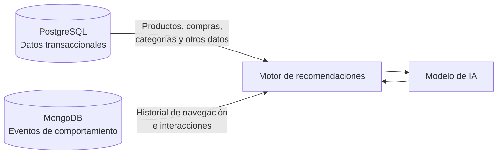
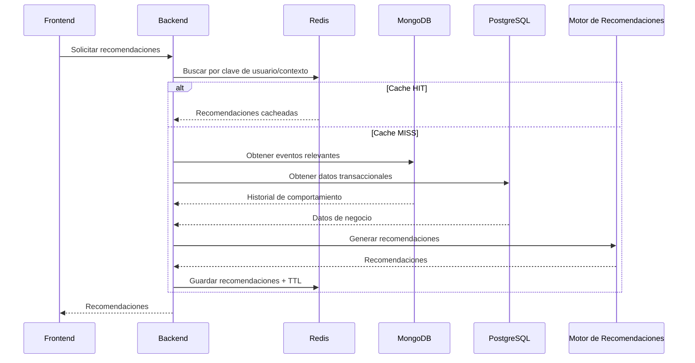

# Arquitectura de datos

> Fuente: documento de primera bajada de modelado del grupo (puntos 1.6, 2 y 3).
> Corresponde al punto 10 de la consigna.

## 1. Componentes

| Componente | Contenido | Motivo |
| --- | --- | --- |
| **PostgreSQL** | Catálogo, SKU, inventario, clientes, pedidos, ítems, reseñas, recomendaciones persistidas | Datos relacionados, con restricciones de integridad y necesidad de consistencia |
| **MongoDB** (`user_events`) | Eventos de interacción del usuario | Alto volumen de escritura, esquema variable por tipo de evento, consulta por rangos temporales |
| **Redis** | Cache de recomendaciones, estado de sesiones anónimas, rankings precalculados y contadores de rate limit | Datos temporales, descartables y sensibles a la latencia: evitan reejecutar el motor y recorrer `user_events` ante solicitudes repetidas |
| **Motor de recomendaciones** | Consumidor de ambas fuentes | Combina estado del negocio y comportamiento observado |

PostgreSQL aporta información sobre el **estado actual del negocio**; MongoDB aporta información
sobre el **comportamiento observado del usuario**. Esta separación evita duplicar innecesariamente
los datos transaccionales en MongoDB.

## 2. Integración entre motores

## 3. Flujo completo de recomendación

Este mecanismo permite que múltiples solicitudes consecutivas para el mismo usuario no impliquen
necesariamente una nueva consulta a MongoDB, PostgreSQL y una nueva inferencia del modelo.

## 4. Pendientes

La consigna pide contemplar, cuando corresponda: fuentes de datos, procesos de carga o ingesta,
almacenamiento operacional, almacenamiento analítico, datos crudos, datos procesados, datos
preparados para IA, componentes de consulta, consumidores de datos y usuarios o aplicaciones que
acceden a la información. También pide justificar si el caso requiere una arquitectura simple o si
conviene pensar en una arquitectura por capas, un Data Warehouse, un Data Lake, un Lakehouse u otro
enfoque.

- [ ] Describir los procesos de ingesta de eventos hacia MongoDB.
- [ ] Definir si existe una capa analítica separada o si el análisis se resuelve sobre los motores
      operacionales.
- [ ] Justificar el enfoque arquitectónico elegido frente a las alternativas mencionadas.
- [ ] Exportar el diagrama como `docs/arquitectura.png`.
