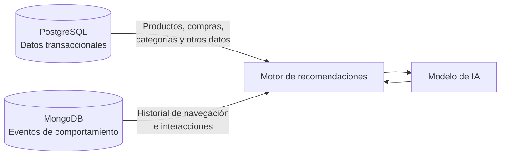
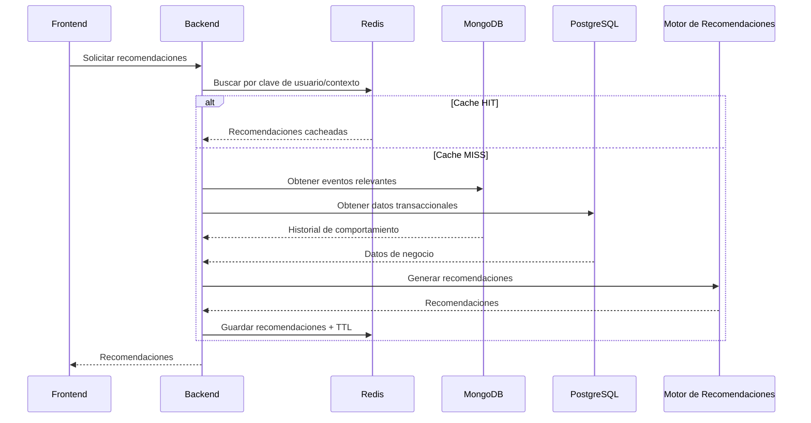

# Arquitectura de datos

> Corresponde al punto 10 de la consigna.

## 1. Componentes

| Componente | Contenido | Motivo |
| --- | --- | --- |
| **PostgreSQL** | Catálogo, SKU, inventario, clientes, pedidos, ítems, reseñas, recomendaciones persistidas | Datos relacionados, con restricciones de integridad y necesidad de consistencia |
| **MongoDB** (`user_events`) | Eventos de interacción del usuario | Alto volumen de escritura, esquema variable por tipo de evento, consulta por rangos temporales |
| **Redis** | Cache de recomendaciones, estado de sesiones anónimas, rankings precalculados y contadores de rate limit | Datos temporales, descartables y sensibles a la latencia: evitan reejecutar el motor y recorrer `user_events` ante solicitudes repetidas |
| **Motor de recomendaciones** | Consumidor de ambas fuentes | Combina estado del negocio y comportamiento observado |

PostgreSQL aporta información sobre el **estado actual del negocio**; MongoDB aporta información
sobre el **comportamiento observado del usuario**. Esta separación evita duplicar innecesariamente
los datos transaccionales en MongoDB.

## 2. Integración entre motores

## 3. Flujo completo de recomendación

Este mecanismo permite que múltiples solicitudes consecutivas para el mismo usuario no impliquen
necesariamente una nueva consulta a MongoDB, PostgreSQL y una nueva inferencia del modelo.

## 4. Circulación del dato, de punta a punta

La consigna pide mostrar cómo circula el dato desde que se genera hasta que lo usa la solución de IA.
Este es el recorrido, con los elementos que enumera.

| Elemento | En este caso |
| --- | --- |
| Fuentes de datos | Tres. La navegación de la persona en la tienda, que produce los eventos. La operación del negocio, que da de alta productos, precios, stock y pedidos. Y el propio motor, que produce recomendaciones. |
| Procesos de carga o ingesta | Los eventos se escriben directamente en `user_events` a medida que ocurren, sin transformación intermedia: se agregan y no se modifican. El catálogo y las transacciones entran por las operaciones del backoffice, con las invariantes que imponen los triggers. Redis no se ingesta: se **deriva** de los otros dos. |
| Almacenamiento operacional | Los tres motores. PostgreSQL guarda el estado del negocio, MongoDB el comportamiento observado y Redis lo que debe responder rápido y es descartable. |
| Almacenamiento analítico | **No existe hoy, y es una decisión.** La retención de 90 días de `user_events` acota el horizonte a la ventana que necesitan las consultas del motor. Un análisis de horizonte más largo, por ejemplo estacional entre años, no corresponde a una colección operacional con TTL y pediría un almacén separado. |
| Datos crudos | Los eventos tal como se registran, con su `metadata` sin normalizar, y los movimientos de inventario, que son inmutables y auditables. |
| Datos procesados | Los que el sistema deriva y mantiene: el total del pedido, que sostienen los triggers desde los ítems; el stock, que se deriva de los movimientos; la vista `v_active_catalog`; y el ranking precalculado de Redis. |
| Datos preparados para IA | El contexto que se arma para el motor: el historial reciente del cliente que devuelve MongoDB, más el estado del negocio que aporta PostgreSQL. La salida del motor vuelve como recomendación persistida en PostgreSQL y como entrada de cache en Redis. |
| Componentes de consulta | Las seis consultas SQL de [`../db/consultas/`](../db/consultas/), las ocho de MongoDB en [`../nosql/mongodb/consultas/`](../nosql/mongodb/consultas/) y los comandos de Redis en [`../nosql/redis/comandos/`](../nosql/redis/comandos/). |
| Consumidores de datos | El motor de recomendaciones, la aplicación que muestra el catálogo y las recomendaciones, y el analista que mira indicadores comerciales. |
| Usuarios o aplicaciones | Cliente identificado y visitante anónimo, que acceden solo a través de la aplicación; operador del negocio; analista; y administrador de la base. Ninguno se conecta directamente a los motores: la matriz de roles está en la sección 13 del informe. |

## 5. Por qué una arquitectura simple y no un Data Warehouse

La consigna pide justificar si el caso requiere una arquitectura simple o conviene pensar en capas, un
Data Warehouse, un Data Lake, un Lakehouse u otro enfoque. Elegimos una **arquitectura simple
multi-motor** y descartamos las otras por lo siguiente.

Un **Data Warehouse** resuelve la consulta analítica sobre datos históricos integrados de varias
fuentes, normalmente con un modelo dimensional y una carga periódica. Aquí la fuente es una sola tienda,
el horizonte útil son 90 días y las consultas analíticas del punto 8 se responden con agregaciones
sobre los motores operacionales. Montarlo agregaría un proceso de carga, una latencia y un modelo más
que mantener, sin resolver ninguna pregunta que hoy no se pueda contestar.

Un **Data Lake** tiene sentido cuando llegan datos crudos de formatos y orígenes heterogéneos que
todavía no se sabe cómo se van a usar. En este caso los datos son tres y están bien tipificados: filas,
documentos de evento y claves efímeras. No hay archivos, ni imágenes, ni volcados externos que
justifiquen almacenar primero y decidir después.

Un **Lakehouse** combina ambos y hereda la complejidad operativa de los dos. Sería difícil de
justificar en un caso cuyo volumen no exige distribución.

Una **arquitectura por capas** con una capa analítica separada es la que primero haría falta si el
caso creciera, y por eso queda anotada como el camino de evolución: la señal para construirla es
necesitar un horizonte más largo que la retención, o que las agregaciones empiecen a competir con la
operación. Ante esta segunda señal, el primer paso previsto tiene un costo menor que el de
una capa completa: una réplica de solo lectura de PostgreSQL para las consultas del analista, que
separa el camino analítico del transaccional sin agregar un modelo nuevo ni un proceso de carga. Se
analiza en la sección 14.3 del informe. Mientras nada de esto ocurra, la separación por
responsabilidad que ya existe entre los tres motores cumple el mismo objetivo con mucho menos costo.

## 6. Diagramas

Los tres diagramas de este documento y los de
[`modelo_conceptual.md`](modelo_conceptual.md), [`modelo_logico_relacional.md`](modelo_logico_relacional.md)
y [`modelo_fisico.md`](modelo_fisico.md) están escritos en Mermaid dentro del propio Markdown. Se
versionan como texto, se revisan en el diff y se renderizan en el repositorio, de modo que no dependen
de una imagen exportada que pueda quedar desactualizada respecto del modelo.
