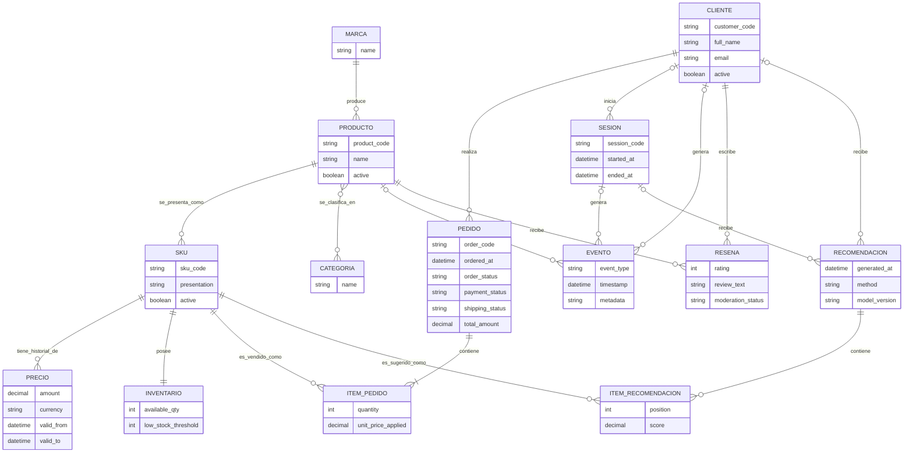

# Modelo conceptual

> Fuente: documento de bajada general del grupo (punto 3). Independiente de la tecnología de
> implementación.

## 1. Producto, SKU y precio

SKU significa *Stock Keeping Unit*, es decir, unidad de mantenimiento de stock. Es un código interno
único que identifica una unidad concreta que puede venderse y controlarse en inventario.

El producto representa el concepto comercial general; el SKU representa una presentación concreta.
Por ejemplo, "Perfume Floral" es el producto, mientras que "Perfume Floral de 50 ml" y "Perfume
Floral de 100 ml" son dos SKU diferentes. Cada SKU puede tener un precio y un stock propios.

```text
PRODUCTO  →  SKU / VARIANTE  →  PRECIO + STOCK  →  PEDIDOS / RECOMENDACIONES
```

El precio vigente se asocia al SKU. Además, el precio efectivamente aplicado debe conservarse en el
ítem de pedido para no perder la historia comercial cuando cambien los precios.

## 2. Entidades principales

| Entidad | Función en el modelo |
| --- | --- |
| Cliente | Representa a la persona registrada que compra, reseña o recibe recomendaciones. |
| Sesión | Vincula de manera durable un identificador de sesión con un cliente, cuando corresponda. |
| Marca | Identifica la marca comercial. |
| Categoría | Clasifica los productos. |
| Producto | Representa el producto comercial general. |
| SKU o variante | Representa la unidad concreta vendible. |
| Inventario | Registra la cantidad disponible por SKU. |
| Pedido / ítem | Representa una compra y sus unidades vendidas. |
| Evento de interacción | Registra visualizaciones, búsquedas y acciones. |
| Reseña | Registra calificaciones y comentarios. |
| Recomendación / ítem | Registra una recomendación, sus productos, método y puntuación. |

## 3. Relaciones y cardinalidades

| Relación | Cardinalidad | Regla conceptual |
| --- | --- | --- |
| Marca – Producto | 1:N | Una marca puede tener muchos productos. |
| Producto – SKU | 1:N | Un producto puede tener una o más variantes. |
| Producto – Categoría | N:M | Un producto puede pertenecer a varias categorías. |
| SKU – Inventario | 1:1 | En el alcance mínimo, cada SKU posee una cantidad disponible. |
| Cliente – Pedido | 1:N | Un cliente puede realizar muchos pedidos. |
| Pedido – Ítem de pedido | 1:N | Un pedido contiene uno o más ítems. |
| Cliente/sesión – Evento | 1:N | MongoDB registra las interacciones con códigos externos estables. |
| Cliente – Reseña | 1:N | Un cliente puede escribir varias reseñas. |
| Cliente/sesión – Recomendación | 1:N | Un cliente o sesión puede recibir varias recomendaciones. |

## 4. Atributos principales

| Entidad | Atributos representativos |
| --- | --- |
| Producto | `product_id`, `product_code`, `name`, `description`, `brand_id`, `attributes`, `active` |
| SKU | `sku_id`, `product_id`, `sku_code`, `presentation`, `size`, `attributes`, `active` |
| Precio de SKU | `price_id`, `sku_id`, `amount`, `currency`, `valid_from`, `valid_to` |
| Inventario | `sku_id`, `available_qty`, `low_stock_threshold`, `updated_at` |
| Pedido | `order_id`, `order_code`, `customer_id`, `ordered_at`, `order_status`, `payment_status`, `shipping_status`, `total_amount` |
| Ítem de pedido | `order_id`, `sku_id`, `quantity`, `unit_price_applied` |
| Evento documental | `timestamp`, `user_id`, `session_id`, `event_type`, `product_id`, `sku_id`, `metadata` |
| Recomendación | `recommendation_id`, `customer_id` o sesión, `generated_at`, `method`, `model_version` |
| Ítem de recomendación | `recommendation_id`, `sku_id`, `position`, `score` |

## 5. Reglas de negocio

1. El código del SKU debe ser único.
2. El precio y el stock no pueden ser negativos.
3. La cantidad de un ítem de pedido debe ser mayor que cero.
4. El precio aplicado debe conservarse aunque cambie el precio vigente.
5. Una reseña debe tener una calificación dentro del rango definido, por ejemplo de 1 a 5.
6. Un producto inactivo o sin stock no debe recomendarse para compra inmediata.
7. Los pedidos cancelados no deben utilizarse como compras efectivas.
8. Todo evento debe conservar fecha y hora y asociarse a un cliente o sesión.
9. Una recomendación debe registrar su fecha, método y, si corresponde, versión del modelo.
10. El acceso a los datos personales debe restringirse según el rol.
11. Los eventos pertenecen a MongoDB y no se duplican como tabla transaccional en PostgreSQL.
12. MongoDB y Redis referencian `product_code`, `customer_code`, `session_code`, `order_code` y `sku_code`, no las claves internas.

## 6. Representación conceptual resumida

```text
CATÁLOGO            →  PRODUCTO / SKU  →  PRECIO / STOCK  →  PEDIDOS
CLIENTES / SESIONES →  EVENTOS         →  RECOMENDACIONES
```

## 7. Diagrama entidad-relación



**Equivalencia con los nombres de la sección 2:** `SESION` = Sesión, `CATEGORIA` = Categoría,
`PRECIO` = Precio de SKU, `EVENTO` = Evento de interacción, `RESENA` = Reseña. Los identificadores
del diagrama evitan tildes y la letra ñ por compatibilidad con el renderizador de Mermaid.

**Por qué Precio es una entidad propia y no un atributo de SKU:** la sección 1 exige conservar el
precio vigente y su historia comercial. Modelarlo como entidad con vigencia (`valid_from`/`valid_to`)
en lugar de un atributo simple de SKU es lo que permite representar esa historia; es el mismo criterio
que ya aplica la sección 4 al listar "Precio de SKU" junto a sus propios atributos.

**Restricciones que la notación de cardinalidad no expresa:**

- Un evento debe asociarse a un cliente identificado, a una sesión, o a ambos (regla de negocio
  N.° 8 de la sección 5). El diagrama muestra ambas relaciones como opcionales porque ninguna es
  individualmente obligatoria, pero al menos una debe estar presente.
- Una recomendación debe pertenecer a un cliente, a una sesión, o a ambos de manera coherente (regla
  de negocio N.° 9 de la sección 5; ver también la restricción física `recommendation_target_ck` en
  el [modelo físico](modelo_fisico.md)).

**Fuera de alcance del modelo conceptual:** los movimientos de inventario (auditoría de stock) y las
tablas puente que resuelven relaciones N:M (`product_category`, `recommendation_item` como tabla de
unión) son decisiones de implementación relacional. Se introducen recién en el
[modelo lógico](modelo_logico_relacional.md) y en el [modelo físico](modelo_fisico.md).
