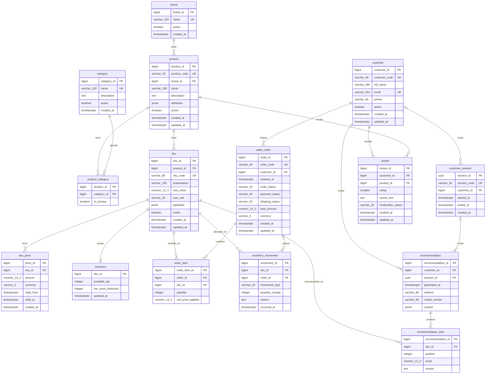

# Modelo físico

> Complementa a [modelo_conceptual.md](modelo_conceptual.md) (independiente de la tecnología) y a
> [modelo_logico_relacional.md](modelo_logico_relacional.md) (esquema relacional con tipos lógicos).
> Este documento detalla la implementación concreta: tipos exactos, claves, índices, triggers y,
> brevemente, los motores NoSQL.

PostgreSQL es el único motor con esquema relacional completo e implementado (ver
[`../db/estructura/01_schema.sql`](../db/estructura/01_schema.sql)). Redis está implementado como capa
clave-valor y MongoDB está diseñado pero pendiente de implementación (ver
[`../nosql/modelo_nosql.md`](../nosql/modelo_nosql.md)); ninguno de los dos tiene tablas ni claves
foráneas propias, por lo que se resumen en la sección 5 en lugar de forzarlos a notación
entidad-relación.

## 1. Diagrama físico de PostgreSQL

Tipos, claves y nulabilidad según [`../db/estructura/01_schema.sql`](../db/estructura/01_schema.sql).
`PK` = clave primaria, `FK` = clave foránea, `UK` = restricción de unicidad.

**Nota de notación:** los tipos con precisión se escriben como `varchar_120` (equivalente a
`VARCHAR(120)`) en lugar de `VARCHAR(120)`, para no depender del soporte de paréntesis y comas dentro
de un tipo en todas las versiones del renderizador de Mermaid. Por el mismo motivo, cuando una columna
es clave primaria y clave foránea a la vez —`product_category.product_id`,
`product_category.category_id`, `inventory.sku_id`, `recommendation_item.recommendation_id` y
`recommendation_item.sku_id`— el diagrama la marca solo como `PK`; su condición de clave foránea surge
de la relación dibujada hacia `product`, `category`, `sku`, `recommendation` y `sku` respectivamente.
El detalle exacto y ejecutable de cada tipo, restricción y valor por defecto está en
[`../db/estructura/01_schema.sql`](../db/estructura/01_schema.sql).

## 2. Restricciones físicas que la notación entidad-relación no expresa

| Restricción (nombre en el DDL) | Tabla | Regla |
| --- | --- | --- |
| `product_one_primary_category_uq` | `product_category` | Un producto tiene, como máximo, una categoría marcada como principal (índice único parcial `WHERE is_primary = TRUE`). |
| `product_brand_name_uq` | `product` | El nombre del producto es único dentro de su marca. |
| `sku_one_open_ended_price_uq` | `sku_price` | Un SKU tiene, como máximo, un precio sin fecha de cierre (índice único parcial `WHERE valid_to IS NULL`). |
| `sku_price_no_overlapping_periods_excl` | `sku_price` | Los períodos de precio de un mismo SKU no pueden superponerse (restricción de exclusión `gist`). |
| `order_item_order_sku_uq` | `order_item` | Un SKU aparece, como máximo, una vez por pedido. |
| `review_customer_product_uq` | `review` | Un cliente escribe, como máximo, una reseña por producto. |
| `customer_email_lower_uq` (índice) | `customer` | El correo es único sin distinguir mayúsculas y minúsculas. |
| `recommendation_target_ck` | `recommendation` | `customer_id` y `session_id` no pueden ser ambos nulos (ver regla de negocio en [modelo_conceptual.md §5](modelo_conceptual.md) y la nota de cardinalidad en su §7). |
| `recommendation_session_customer_fk` | `recommendation` | Si una recomendación tiene sesión y cliente a la vez, el par debe existir en `customer_session` (clave foránea compuesta sobre `(session_id, customer_id)`). |
| `inventory_movement_sign_ck` / `inventory_movement_order_required_ck` | `inventory_movement` | El signo de `quantity_change` depende del tipo de movimiento; ventas, devoluciones y cancelaciones exigen `order_id`. |
| Disparadores de inmutabilidad y validación (sección 4) | `inventory_movement`, `sales_order`, `order_item` | Ver tabla de triggers. |

## 3. Índices y vista operativa

Fuente: [`../db/indices_vistas/01_indices_vistas.sql`](../db/indices_vistas/01_indices_vistas.sql).

| Índice | Tabla | Columnas | Propósito |
| --- | --- | --- | --- |
| `product_brand_active_idx` | `product` | `brand_id, active` | Listar productos activos de una marca. |
| `product_category_category_idx` | `product_category` | `category_id, product_id` | Resolver una categoría hacia sus productos. |
| `sku_product_active_idx` | `sku` | `product_id, active` | Listar variantes activas de un producto. |
| `sku_price_history_idx` | `sku_price` | `sku_id, valid_from DESC` | Recorrer el historial de precios de un SKU. |
| `inventory_low_stock_idx` | `inventory` | `available_qty, sku_id` (parcial) | Detectar stock bajo sin recorrer toda la tabla. |
| `customer_session_customer_time_idx` | `customer_session` | `customer_id, started_at DESC` (parcial) | Últimas sesiones de un cliente identificado. |
| `sales_order_customer_status_time_idx` | `sales_order` | `customer_id, order_status, ordered_at DESC` | Historial de pedidos de un cliente por estado. |
| `sales_order_completed_time_idx` | `sales_order` | `ordered_at DESC` (parcial) | Pedidos efectivamente concretados, por fecha. |
| `order_item_sku_order_idx` | `order_item` | `sku_id, order_id` | Ítems de pedido de un SKU (ventas conjuntas). |
| `inventory_movement_sku_time_idx` | `inventory_movement` | `sku_id, occurred_at DESC` | Auditoría de stock de un SKU. |
| `review_product_status_idx` | `review` | `product_id, moderation_status, created_at DESC` | Reseñas aprobadas de un producto. |
| `recommendation_customer_time_idx` / `recommendation_session_time_idx` | `recommendation` | `customer_id`/`session_id, generated_at DESC` (parciales) | Últimas recomendaciones por cliente o sesión. |
| `recommendation_item_sku_idx` | `recommendation_item` | `sku_id, recommendation_id` | En qué recomendaciones aparece un SKU. |
| `product_attributes_gin_idx` / `sku_attributes_gin_idx` | `product`, `sku` | `attributes` (GIN) | Filtrar por claves o valores dentro del JSONB. |

La vista `v_active_catalog` reúne producto, marca, SKU, precio vigente e inventario disponible en una
sola consulta; es la base de la consulta representativa 1
([`../db/consultas/01_catalogo_activo_disponibilidad.sql`](../db/consultas/01_catalogo_activo_disponibilidad.sql)).

## 4. Funciones y triggers de integridad

Fuente: [`../db/estructura/01_schema.sql`](../db/estructura/01_schema.sql).

| Función / trigger | Tabla | Qué garantiza |
| --- | --- | --- |
| `set_updated_at` | `product`, `sku`, `customer`, `sales_order`, `review` | Actualiza `updated_at` en cada modificación. |
| `apply_order_total_delta` | `order_item` → `sales_order` | Mantiene `total_amount` del pedido por deltas atómicos al insertar, actualizar o eliminar ítems. |
| `validate_sale_inventory_movement` | `inventory_movement` | Una salida de tipo venta exige un pedido completado y pagado que respalde esa cantidad del SKU. |
| `validate_compensating_inventory_movement` | `inventory_movement` | Una devolución o cancelación solo compensa unidades previamente vendidas del mismo pedido y SKU, sin superar la cantidad vendida. |
| `protect_effective_order_with_sales` | `sales_order` | Un pedido con ventas sin compensar no puede dejar de estar completado y pagado; la transición se permite tras compensación total. |
| `protect_order_item_with_sales` | `order_item` | Un ítem con ventas registradas no se puede quitar, reasignar, reducir por debajo de lo vendido ni cambiar de precio. |
| `apply_inventory_movement` | `inventory_movement` → `inventory` | Aplica cada movimiento al stock vigente; la restricción de `inventory` impide que quede negativo. |
| `prevent_inventory_movement_change` | `inventory_movement` | Los movimientos son inmutables: no se editan ni se borran, solo se compensan. |

### 4.1 Roles y protección de campos derivados

Fuente: [`../db/seguridad/01_roles_permisos.sql`](../db/seguridad/01_roles_permisos.sql).

| Rol | Acceso físico |
| --- | --- |
| Propietario (`POSTGRES_USER`) | DDL, carga y validación; no se usa como identidad normal de la aplicación. |
| `bdia_app` (`NOLOGIN`) | Lectura operativa y escritura por tabla/columna. Puede insertar movimientos e ítems, pero no escribir `inventory.available_qty` ni `sales_order.total_amount`, ni modificar o borrar movimientos. |
| `bdia_analyst` (`NOLOGIN`) | Lectura del catálogo y de datos comerciales agregables, sin acceso directo a `customer`, `customer_session` ni `review`. |

`apply_inventory_movement` y `apply_order_total_delta` son las únicas funciones
que necesitan modificar los dos campos derivados. Se ejecutan como
`SECURITY DEFINER` y fijan `search_path` en los esquemas confiables, dejando
`pg_temp` en último lugar, para no resolver objetos controlados por el invocante.
Los permisos de ejecución de las funciones del esquema se revocan de `PUBLIC`.

## 5. Modelo físico complementario (NoSQL)

PostgreSQL es el único motor con esquema relacional; Redis y MongoDB se modelan distinto porque no
tienen tablas ni claves foráneas. El detalle completo está en
[`../nosql/modelo_nosql.md`](../nosql/modelo_nosql.md).

**MongoDB — `user_events`** (diseñado, implementación pendiente): colección única de tipo *Time
Series* (`timeField: timestamp`), un documento por evento (`product_view`, `search`, `add_to_cart`,
`purchase`), con `user_id` y/o `session_id`, `event_type` y `metadata` de forma libre. No tiene
relaciones ni claves foráneas: el vínculo con PostgreSQL es lógico, a través de los códigos
compartidos (ver sección 6).

**Redis** (implementado): cuatro familias de claves, sin esquema ni índices secundarios propios; la
clave misma cumple ese rol.

| Estructura | Clave | Tipo Redis |
| --- | --- | --- |
| Cache de recomendaciones | `reco:user:{customer_code}:{contexto}` / `reco:sess:{session_code}:{contexto}` | String (JSON), TTL 600 s |
| Estado temporal de sesión | `session:{session_code}` | Hash, TTL deslizante 1800 s |
| Ranking precalculado | `ranking:productos:vistos:{ventana}` | Sorted Set, TTL 3600 s |
| Rate limit y contadores | `ratelimit:reco:...:{ventana}` / `contador:{reco}:{metrica}` | String contador |

Detalle completo de claves, políticas de expiración y evidencia medida en
[`../nosql/modelo_nosql.md`](../nosql/modelo_nosql.md).

## 6. Identificadores compartidos entre motores

Ver la tabla completa en
[modelo_logico_relacional.md](modelo_logico_relacional.md#identificadores-entre-motores): cada
entidad expone una clave interna de PostgreSQL y un código externo estable (`product_code`,
`sku_code`, `customer_code`, `session_code`, `order_code`) que es lo único que usan MongoDB y Redis
para referenciarla.
