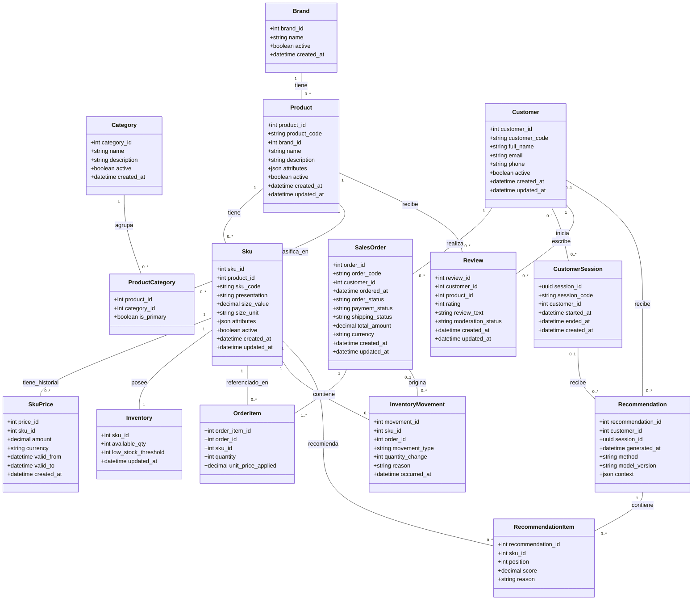

# Modelo lógico relacional de PostgreSQL

PostgreSQL es la fuente principal de verdad para el catálogo y las operaciones
comerciales. Los eventos de navegación pertenecen a MongoDB y el estado temporal
a Redis; no se duplican como tablas transaccionales.

## Relaciones

| Relación | Clave primaria | Claves foráneas y función |
| --- | --- | --- |
| `brand` | `brand_id` | Marca comercial. |
| `category` | `category_id` | Clasificación de productos. |
| `product` | `product_id` | `brand_id → brand`; `product_code` es el código externo. |
| `product_category` | `(product_id, category_id)` | Resuelve Producto–Categoría N:M y marca una categoría principal. |
| `sku` | `sku_id` | `product_id → product`; variante vendible identificada por `sku_code`. |
| `sku_price` | `price_id` | `sku_id → sku`; historial temporal sin períodos superpuestos. |
| `inventory` | `sku_id` | Relación 1:1 con `sku`; cantidad y umbral vigentes. |
| `inventory_movement` | `movement_id` | `sku_id → sku`; registro inmutable que explica el stock. |
| `customer` | `customer_id` | Cliente identificado externamente por `customer_code`. |
| `customer_session` | `session_id` | `customer_id → customer` opcional; `session_code` conecta los motores. |
| `sales_order` | `order_id` | `customer_id → customer`; `order_code` es el código externo; estados simples de pedido, pago y envío. |
| `order_item` | `order_item_id` | `order_id → sales_order`, `sku_id → sku`; conserva el precio aplicado. |
| `review` | `review_id` | `customer_id → customer`, `product_id → product`. |
| `recommendation` | `recommendation_id` | Cliente o sesión; trazabilidad persistente de resultados sintéticos. |
| `recommendation_item` | `(recommendation_id, sku_id)` | Posición y puntuación de cada SKU recomendado. |

## Diagrama de clases (UML)

Representación UML del mismo modelo relacional. Los tipos son lógicos (portables), no los tipos
exactos de PostgreSQL: esos se detallan recién en el [modelo físico](modelo_fisico.md).

**Convenciones del diagrama:**

- El primer atributo de cada clase es su clave primaria (compuesta en `ProductCategory` y
  `RecommendationItem`, donde ambos atributos listados forman la clave).
- Todo atributo `*_id` que no sea la clave primaria de su propia clase es una clave foránea hacia la
  clase del mismo nombre (p. ej., `brand_id` en `Product` referencia a `Brand`).
- `Inventory.sku_id` es, a la vez, clave primaria y clave foránea: es la relación 1:1 con `Sku`.
- Los tipos son lógicos: `json` corresponde a JSONB, `uuid` a UUID y `decimal`/`datetime` a los
  campos numéricos y de fecha-hora de PostgreSQL. El detalle exacto (precisión, longitud,
  nulabilidad) está en el [modelo físico](modelo_fisico.md).
- A diferencia del modelo conceptual, aquí `ProductCategory` y `RecommendationItem` aparecen como
  clases explícitas porque resuelven relaciones N:M o llevan atributos propios (`is_primary`,
  `position`, `score`); y aparece `InventoryMovement`, ausente en el modelo conceptual por ser un
  mecanismo de auditoría de la implementación relacional y no un concepto de negocio.

## Identificadores entre motores

| Concepto | Clave interna PostgreSQL | Código compartido |
| --- | --- | --- |
| Producto | `product_id` | `product_code` (`product-001`) |
| Variante | `sku_id` | `sku_code` (`AUR-LUM-050`) |
| Cliente | `customer_id` | `customer_code` (`user-123`) |
| Sesión | `session_id` | `session_code` (`session-456`) |
| Pedido | `order_id` | `order_code` (`order-321`) |

MongoDB y Redis usan exclusivamente los códigos compartidos. Así no dependen
del orden de generación de claves internas en PostgreSQL.

## Normalización y excepciones controladas

El modelo se mantiene en tercera forma normal: marcas, categorías, productos,
variantes, precios, pedidos e ítems se separan según sus dependencias. Las
relaciones N:M utilizan tablas puente.

Se conservan dos redundancias deliberadas:

- `order_item.unit_price_applied`, para preservar el precio histórico de la compra;
- `sales_order.total_amount`, mantenido por trigger mediante deltas atómicos desde sus ítems.

Los atributos variables no estructurales usan JSONB en `product.attributes` y
`sku.attributes`. Precio, stock, marca, categoría y relaciones comerciales no
se almacenan dentro de JSONB.

## Reglas principales

- Códigos externos y códigos de SKU únicos.
- Un producto tiene como máximo una categoría principal.
- Cada SKU tiene como máximo un precio vigente y no admite períodos superpuestos.
- Precios, cantidades y stock no pueden ser negativos.
- Cada tipo de movimiento exige un signo coherente: las ventas descuentan y los ingresos reponen.
- Una venta de inventario exige un pedido completado y pagado, el mismo SKU y una cantidad que no supere lo comprado.
- Los movimientos de inventario son inmutables y actualizan el stock mediante trigger.
- Una reseña por cliente y producto, con calificación de 1 a 5.
- Una recomendación debe pertenecer a un cliente, a una sesión o a ambos de manera coherente.
- Los pedidos cancelados o con pago no aprobado no cuentan como compras efectivas.
