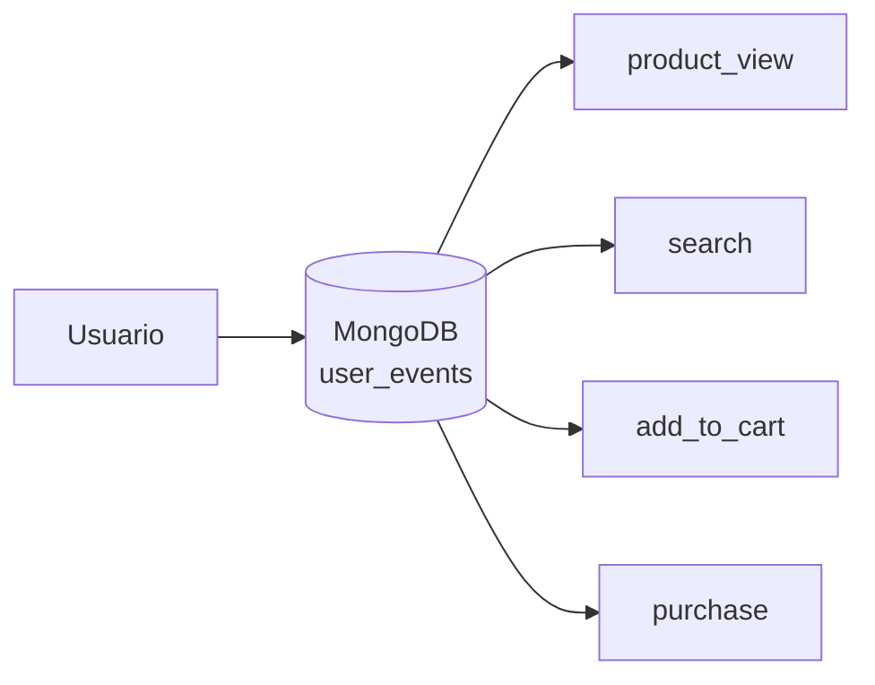
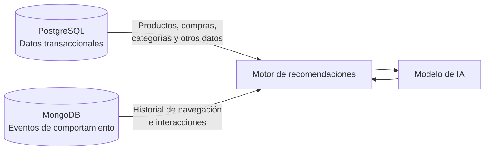
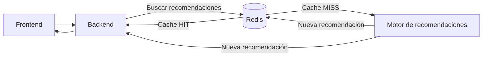

# Modelo NoSQL

> Fuente: documento de primera bajada de modelado del grupo.

La solución combina tres motores. Este documento cubre los dos componentes NoSQL:

- **MongoDB** — eventos de interacción del usuario (base documental / series de tiempo).
- **Redis** — cache de corto plazo de las recomendaciones generadas (clave-valor).

Los datos transaccionales y de catálogo permanecen en **PostgreSQL** (ver [`../db/`](../db/)).

---

# 1. Eventos de usuario — MongoDB

Para el almacenamiento de eventos se selecciona **MongoDB como base de datos documental**.

Los eventos de navegación presentan características diferentes a los datos transaccionales:

- se generan con mucha frecuencia;
- el volumen acumulado crece continuamente;
- son principalmente operaciones de escritura;
- los eventos son independientes entre sí;
- distintos tipos de eventos pueden poseer metadatos diferentes;
- no requieren las relaciones y restricciones de integridad propias del modelo transaccional;
- una vez registrados, los eventos son principalmente inmutables.

El modelo documental permite representar cada evento como un documento independiente y flexible,
evitando modificar un esquema rígido cada vez que se incorpora información adicional a un determinado
tipo de evento. Esto resulta especialmente útil donde el conjunto de datos relevantes para el modelo
de recomendaciones puede evolucionar durante el desarrollo.

Además, mantener estos eventos separados de los datos transaccionales permite evitar sobrecargar el
modelo principal de la aplicación con un volumen de información que crece continuamente y que tiene
un propósito principalmente analítico y de generación de recomendaciones.

Por otro lado, MongoDB dispone de **Time Series Collections**, diseñadas para almacenar datos
asociados a una marca temporal. Esta funcionalidad resulta apropiada para los eventos porque permite
organizar eficientemente información que se genera continuamente y que posteriormente será consultada
principalmente por rangos temporales.

Cassandra presenta excelentes características para cargas de escritura masivas y distribuidas, pero
introduce una mayor complejidad de modelado y operación. MongoDB ofrece suficiente escalabilidad para
el volumen esperado y mayor flexibilidad para este sistema.

## 1.1 Colecciones

Se propone mantener un modelo sencillo, utilizando una única colección de series de tiempo:

```text
MongoDB
└── user_events
```

La colección `user_events` almacenará todos los eventos de interacción relevantes. Al tratarse de
eventos independientes e inmutables, no es necesario mantener relaciones entre documentos como las
que existirían en el modelo relacional.

No se requiere una colección independiente para cada tipo de evento: todos comparten atributos
comunes y sus diferencias se representan mediante `event_type` y `metadata`.

Conceptualmente:



## 1.2 Estructura de los documentos

Cada documento tendrá una estructura general similar a:

```json
{
  "_id": "event-id",
  "timestamp": "2026-08-19T15:30:00Z",
  "user_id": "user-123",
  "session_id": "session-456",
  "event_type": "product_view",
  "product_id": "product-789",
  "metadata": {}
}
```

Los atributos principales son:

| Atributo | Descripción |
| --- | --- |
| `_id` | Identificador único del evento |
| `timestamp` | Momento en que ocurrió el evento |
| `user_id` | Usuario que generó la interacción |
| `session_id` | Sesión de navegación asociada |
| `event_type` | Tipo de interacción |
| `product_id` | Producto involucrado, cuando corresponda |
| `metadata` | Información adicional específica del evento |

El atributo `metadata` permite mantener cierta flexibilidad documental sin crear estructuras
diferentes para cada evento. Esta flexibilidad permite incorporar nuevos metadatos y tipos de eventos
durante la evolución del sistema sin modificar la estructura de los eventos existentes.

Los documentos de ejemplo (`product_view`, `search`, `add_to_cart`, `purchase`) están en
[`../data/ejemplos/user_events.json`](../data/ejemplos/user_events.json).

El evento `purchase` permite representar la secuencia de comportamiento del usuario, aunque la
información comercial detallada de la orden continúa siendo responsabilidad de PostgreSQL.

## 1.3 Time Series Collection

La colección `user_events` se implementaría como una **Time Series Collection**, utilizando
`timestamp` como `timeField`.

La ventaja principal para este caso es que los eventos poseen naturalmente una dimensión temporal y
las consultas más frecuentes utilizan rangos como:

- eventos del usuario durante los últimos 7 días;
- eventos del último mes;
- productos vistos durante la sesión actual.

Esto resulta especialmente adecuado para un sistema donde los eventos se agregan continuamente y
raramente son modificados.

## 1.4 Consultas principales para el sistema de recomendaciones

Las consultas deben proporcionar un **contexto de comportamiento reciente y relevante** al motor.
MongoDB proporcionará al motor el historial de comportamiento reciente y relevante del usuario.

### Historial reciente de un usuario

```javascript
db.user_events.find({
  user_id: "user-123",
  timestamp: {
    $gte: ISODate("2026-08-12T00:00:00Z")
  }
}).sort({
  timestamp: -1
})
```

Esta información permite identificar productos recientemente visualizados, búsquedas recientes y
acciones de mayor intención.

### Productos más interactuados por un usuario

Una agregación puede utilizar eventos como `product_view` y `add_to_cart` para determinar qué
productos o categorías muestran mayor interés.

```javascript
db.user_events.aggregate([
  {
    $match: {
      user_id: "user-123",
      event_type: {
        $in: ["product_view", "add_to_cart"]
      }
    }
  },
  {
    $group: {
      _id: "$product_id",
      interactions: { $sum: 1 }
    }
  },
  {
    $sort: {
      interactions: -1
    }
  }
])
```

El resultado puede utilizarse como parte de las características entregadas al modelo.

### Eventos de una sesión

```javascript
db.user_events.find({
  user_id: "user-123",
  session_id: "session-456"
}).sort({
  timestamp: 1
})
```

Permite reconstruir parcialmente el recorrido del usuario durante una sesión.

## 1.5 Consultas analíticas

Además de alimentar el modelo, los eventos permiten analizar el comportamiento general de los
usuarios. Algunos ejemplos son:

- productos más visualizados;
- categorías con mayor interés;
- cantidad de búsquedas realizadas;
- relación entre visualizaciones y agregados al carrito;
- productos con muchas visualizaciones pero pocas compras;
- comportamiento de usuarios durante una sesión.

Por ejemplo, podría calcularse qué productos reciben mayor cantidad de visualizaciones:

```javascript
db.user_events.aggregate([
  {
    $match: {
      event_type: "product_view"
    }
  },
  {
    $group: {
      _id: "$product_id",
      views: { $sum: 1 }
    }
  },
  {
    $sort: {
      views: -1
    }
  }
])
```

Estas consultas permiten generar información útil para el análisis del negocio y para el
entrenamiento y evaluación del modelo.

## 1.6 Integración con PostgreSQL

MongoDB no reemplaza a PostgreSQL. El motor de recomendaciones utilizará información proveniente de
ambas fuentes:



PostgreSQL aporta principalmente información sobre el estado actual del negocio, mientras que MongoDB
aporta información sobre el **comportamiento observado del usuario**.

Esta separación evita duplicar innecesariamente los datos transaccionales en MongoDB y permite que
cada tecnología se utilice para el tipo de información para el que resulta más adecuada.

Por ejemplo, para generar recomendaciones el motor podría recibir:

```text
Datos transaccionales:
- productos disponibles
- compras anteriores
- categorías de productos
- información del catálogo

Datos del comportamiento:
- productos vistos recientemente
- búsquedas recientes
- productos agregados al carrito
- comportamiento de la sesión actual
```

## 1.7 Pendientes de este componente

- Definir los índices propuestos sobre `user_events` (por ejemplo `user_id + timestamp`,
  `session_id`, `event_type`).
- Definir la política de retención / expiración de eventos.
- Definir el catálogo cerrado de valores de `event_type`.

---

# 2. Modelado de la cache — Redis

Redis se utilizará como una cache de corto plazo ubicada entre la aplicación y el motor de
recomendaciones.

El objetivo es evitar ejecutar repetidamente el mismo proceso cuando un usuario solicita
recomendaciones varias veces en un período reducido. De esta manera, se reducen las consultas a
PostgreSQL y MongoDB y, principalmente, la cantidad de veces que debe ejecutarse el motor de
recomendaciones y el modelo de IA.

El patrón utilizado será:



## 2.1 Clave de cache

Una clave podría tener la siguiente estructura:

```text
recommendations:{user_id}:{context}
```

Por ejemplo:

```text
recommendations:user-123:home
```

Esto permite diferenciar recomendaciones solicitadas para distintos contextos, por ejemplo:

- página principal;
- página de producto;
- carrito;
- categoría.

## 2.2 Valor almacenado

El valor podría ser un documento JSON similar a:

```json
{
  "generated_at": "2026-08-19T15:40:00Z",
  "model_version": "v1",
  "recommendations": [
    { "product_id": "product-123", "score": 0.94 },
    { "product_id": "product-456", "score": 0.89 }
  ]
}
```

La información puede almacenarse con un **TTL reducido**, por ejemplo entre 5 y 15 minutos.

El TTL evita que una recomendación quede almacenada indefinidamente, permitiendo que los nuevos
eventos del usuario eventualmente provoquen una nueva generación.

## 2.3 Pendientes de este componente

- Definir el comportamiento de la cache para sesiones anónimas (clave por `session_id`).
- Definir si corresponde invalidar explícitamente la clave ante ciertos eventos (por ejemplo, una
  compra) además del vencimiento por TTL.
