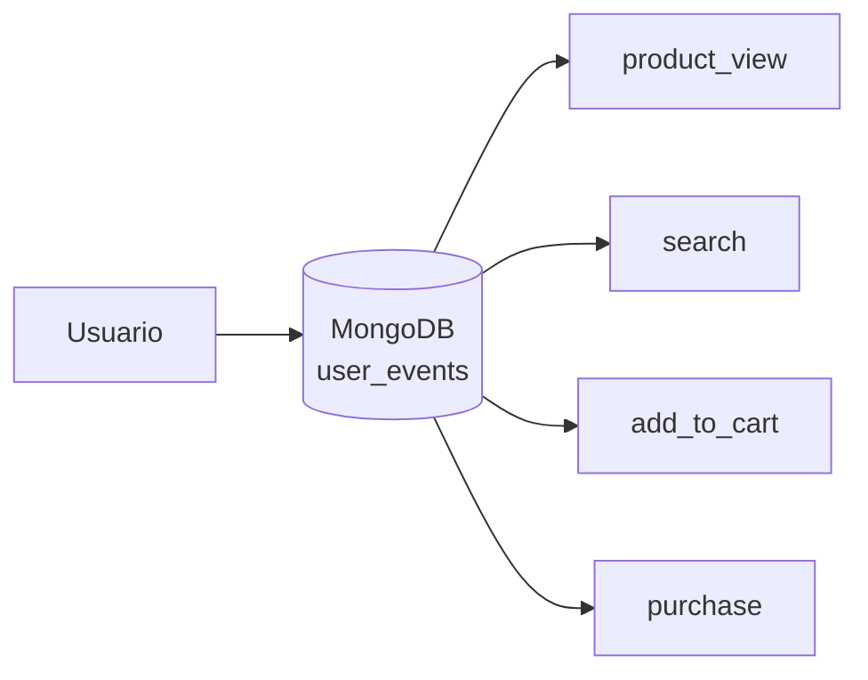
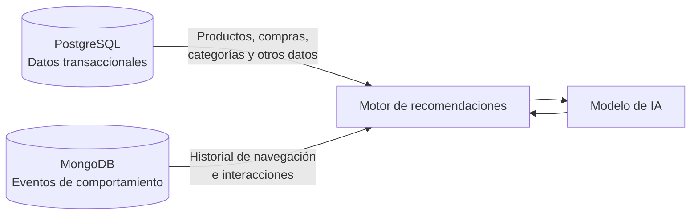
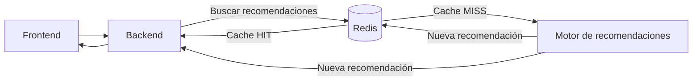

# Modelo NoSQL

> Fuente: documento de primera bajada de modelado del grupo, ampliado con la implementación.

La solución combina tres motores. Este documento cubre los dos componentes NoSQL:

- **MongoDB**: eventos de interacción del usuario (base documental / series de tiempo).
  Modelo definido; implementación pendiente.
- **Redis**, capa clave-valor: cache de recomendaciones, sesiones anónimas, rankings
  precalculados y rate limit. Modelo e implementación completos en [`redis/`](redis/).

Los datos transaccionales y de catálogo permanecen en **PostgreSQL** (ver [`../db/`](../db/)).

---

# 1. Eventos de usuario en MongoDB

Para el almacenamiento de eventos se selecciona **MongoDB como base de datos documental**.

Los eventos de navegación presentan características diferentes a los datos transaccionales:

- se generan con mucha frecuencia;
- el volumen acumulado crece continuamente;
- son principalmente operaciones de escritura;
- los eventos son independientes entre sí;
- distintos tipos de eventos pueden poseer metadatos diferentes;
- no requieren las relaciones y restricciones de integridad propias del modelo transaccional;
- una vez registrados, los eventos son principalmente inmutables.

El modelo documental permite representar cada evento como un documento independiente y flexible,
evitando modificar un esquema rígido cada vez que se incorpora información adicional a un determinado
tipo de evento. Esto resulta especialmente útil donde el conjunto de datos relevantes para el modelo
de recomendaciones puede evolucionar durante el desarrollo.

Además, mantener estos eventos separados de los datos transaccionales permite evitar sobrecargar el
modelo principal de la aplicación con un volumen de información que crece continuamente y que tiene
un propósito principalmente analítico y de generación de recomendaciones.

Por otro lado, MongoDB dispone de **Time Series Collections**, diseñadas para almacenar datos
asociados a una marca temporal. Esta funcionalidad resulta apropiada para los eventos porque permite
organizar eficientemente información que se genera continuamente y que posteriormente será consultada
principalmente por rangos temporales.

Cassandra presenta excelentes características para cargas de escritura masivas y distribuidas, pero
introduce una mayor complejidad de modelado y operación. MongoDB ofrece suficiente escalabilidad para
el volumen esperado y mayor flexibilidad para este sistema.

## 1.1 Colecciones

Se propone mantener un modelo sencillo, utilizando una única colección de series de tiempo:

```text
MongoDB
└── user_events
```

La colección `user_events` almacenará todos los eventos de interacción relevantes. Al tratarse de
eventos independientes e inmutables, no es necesario mantener relaciones entre documentos como las
que existirían en el modelo relacional.

No se requiere una colección independiente para cada tipo de evento: todos comparten atributos
comunes y sus diferencias se representan mediante `event_type` y `metadata`.

Conceptualmente:



## 1.2 Estructura de los documentos

Cada documento tendrá una estructura general similar a:

```json
{
  "_id": "event-id",
  "timestamp": "2026-08-19T15:30:00Z",
  "user_id": "user-123",
  "session_id": "session-456",
  "event_type": "product_view",
  "product_id": "product-789",
  "metadata": {}
}
```

Los atributos principales son:

| Atributo | Descripción |
| --- | --- |
| `_id` | Identificador único del evento |
| `timestamp` | Momento en que ocurrió el evento |
| `user_id` | Usuario que generó la interacción |
| `session_id` | Sesión de navegación asociada |
| `event_type` | Tipo de interacción |
| `product_id` | Producto involucrado, cuando corresponda |
| `metadata` | Información adicional específica del evento |

El atributo `metadata` permite mantener cierta flexibilidad documental sin crear estructuras
diferentes para cada evento. Esta flexibilidad permite incorporar nuevos metadatos y tipos de eventos
durante la evolución del sistema sin modificar la estructura de los eventos existentes.

Los documentos de ejemplo (`product_view`, `search`, `add_to_cart`, `purchase`) están en
[`../data/ejemplos/user_events.json`](../data/ejemplos/user_events.json).

El evento `purchase` permite representar la secuencia de comportamiento del usuario, aunque la
información comercial detallada de la orden continúa siendo responsabilidad de PostgreSQL.

## 1.3 Time Series Collection

La colección `user_events` se implementaría como una **Time Series Collection**, utilizando
`timestamp` como `timeField`.

La ventaja principal para este caso es que los eventos poseen naturalmente una dimensión temporal y
las consultas más frecuentes utilizan rangos como:

- eventos del usuario durante los últimos 7 días;
- eventos del último mes;
- productos vistos durante la sesión actual.

Esto resulta especialmente adecuado para un sistema donde los eventos se agregan continuamente y
raramente son modificados.

## 1.4 Consultas principales para el sistema de recomendaciones

Las consultas deben proporcionar un **contexto de comportamiento reciente y relevante** al motor.
MongoDB proporcionará al motor el historial de comportamiento reciente y relevante del usuario.

### Historial reciente de un usuario

```javascript
db.user_events.find({
  user_id: "user-123",
  timestamp: {
    $gte: ISODate("2026-08-12T00:00:00Z")
  }
}).sort({
  timestamp: -1
})
```

Esta información permite identificar productos recientemente visualizados, búsquedas recientes y
acciones de mayor intención.

### Productos más interactuados por un usuario

Una agregación puede utilizar eventos como `product_view` y `add_to_cart` para determinar qué
productos o categorías muestran mayor interés.

```javascript
db.user_events.aggregate([
  {
    $match: {
      user_id: "user-123",
      event_type: {
        $in: ["product_view", "add_to_cart"]
      }
    }
  },
  {
    $group: {
      _id: "$product_id",
      interactions: { $sum: 1 }
    }
  },
  {
    $sort: {
      interactions: -1
    }
  }
])
```

El resultado puede utilizarse como parte de las características entregadas al modelo.

### Eventos de una sesión

```javascript
db.user_events.find({
  user_id: "user-123",
  session_id: "session-456"
}).sort({
  timestamp: 1
})
```

Permite reconstruir parcialmente el recorrido del usuario durante una sesión.

## 1.5 Consultas analíticas

Además de alimentar el modelo, los eventos permiten analizar el comportamiento general de los
usuarios. Algunos ejemplos son:

- productos más visualizados;
- categorías con mayor interés;
- cantidad de búsquedas realizadas;
- relación entre visualizaciones y agregados al carrito;
- productos con muchas visualizaciones pero pocas compras;
- comportamiento de usuarios durante una sesión.

Por ejemplo, podría calcularse qué productos reciben mayor cantidad de visualizaciones:

```javascript
db.user_events.aggregate([
  {
    $match: {
      event_type: "product_view"
    }
  },
  {
    $group: {
      _id: "$product_id",
      views: { $sum: 1 }
    }
  },
  {
    $sort: {
      views: -1
    }
  }
])
```

Estas consultas permiten generar información útil para el análisis del negocio y para el
entrenamiento y evaluación del modelo.

## 1.6 Integración con PostgreSQL

MongoDB no reemplaza a PostgreSQL. El motor de recomendaciones utilizará información proveniente de
ambas fuentes:



PostgreSQL aporta principalmente información sobre el estado actual del negocio, mientras que MongoDB
aporta información sobre el **comportamiento observado del usuario**.

Esta separación evita duplicar innecesariamente los datos transaccionales en MongoDB y permite que
cada tecnología se utilice para el tipo de información para el que resulta más adecuada.

Por ejemplo, para generar recomendaciones el motor podría recibir:

```text
Datos transaccionales:
- productos disponibles
- compras anteriores
- categorías de productos
- información del catálogo

Datos del comportamiento:
- productos vistos recientemente
- búsquedas recientes
- productos agregados al carrito
- comportamiento de la sesión actual
```

## 1.7 Pendientes de este componente

- Definir los índices propuestos sobre `user_events` (por ejemplo `user_id + timestamp`,
  `session_id`, `event_type`).
- Definir la política de retención / expiración de eventos.
- Definir el catálogo cerrado de valores de `event_type`.

---

# 2. Modelado de la capa clave-valor en Redis

> Implementación en [`redis/`](redis/). Los comandos de cada estructura están en
> [`redis/comandos/`](redis/comandos/).

Redis se utiliza como capa clave-valor de corto plazo ubicada entre la aplicación y el motor de
recomendaciones.

El objetivo principal es evitar ejecutar repetidamente el mismo proceso cuando un usuario solicita
recomendaciones varias veces en un período reducido. De esta manera, se reducen las consultas a
PostgreSQL y MongoDB y, principalmente, la cantidad de veces que debe ejecutarse el motor de
recomendaciones y el modelo de IA.

El patrón utilizado será:



## 2.1 Alcance de la capa clave-valor

Además de la cache de recomendaciones, Redis resuelve otras tres necesidades del caso que comparten
la misma característica: son datos temporales, descartables y sensibles a la latencia.

Las recomendaciones, las sesiones y los rankings son **reconstruibles**: se derivan de PostgreSQL,
MongoDB y el motor. Los contadores operativos y la cuota de rate limit en curso **no lo son**, porque
son acumulados propios de Redis. Lo que comparten las cuatro estructuras es que su contenido es
**descartable**: perderlo es aceptable.

| # | Estructura | Necesidad del caso que resuelve |
| --- | --- | --- |
| 1 | Cache de recomendaciones | Evitar reejecutar el motor ante solicitudes repetidas. |
| 2 | Sesión de visitante anónimo | Sostener el estado de un visitante no registrado sin escribir datos personales en PostgreSQL. |
| 3 | Ranking precalculado | Servir la agregación "productos más vistos" sin recorrer `user_events` en cada visita. |
| 4 | Rate limit y contadores | Acotar cuántas veces un cliente puede invocar el motor y llevar acumulados operativos. |

Las cuatro corresponden a usos característicos del modelo clave-valor: caché, sesiones, rankings,
resultados precalculados, contadores y limitación de consultas por usuario.

Lo que **no** va en Redis: nada que deba sobrevivir. El pedido, el precio aplicado, el inventario y
el catálogo viven en PostgreSQL; los eventos, en MongoDB. Redis no es fuente de verdad de ningún
dato del modelo.

## 2.2 Convención de nombres de claves

Redis no tiene esquema ni índices secundarios: **la clave es el único criterio de acceso**. Por eso
su diseño es la decisión de modelado central de esta capa.

```text
{dominio}:{tipo_de_sujeto}:{identificador}[:{cualificador}]
```

Reglas adoptadas:

1. Segmentos separados por `:`, siguiendo la convención habitual de Redis.
2. El primer segmento identifica el dominio funcional (`reco`, `session`, `ranking`, `ratelimit`,
   `contador`) y permite recorrer cada familia con `SCAN MATCH`.
3. Cuando el sujeto puede ser un cliente registrado o una sesión anónima, el segundo segmento lo
   discrimina (`user` / `sess`). **Sin este discriminador, un `session_id` y un `customer_id` con el
   mismo texto compartirían entrada de cache**, y una sesión anónima podría recibir las
   recomendaciones de un cliente registrado.
4. Los nombres se mantienen cortos: la clave ocupa memoria en cada entrada. Por eso la primera
   versión del documento, que proponía `recommendations:{user_id}:{context}`, se abrevió a `reco:`.
5. El discriminador `user` / `sess` se aplica a **todas** las estructuras cuyo sujeto puede ser de
   ambos tipos, no solo a la cache. El rate limit también lo lleva: el motor se invoca igual para un
   visitante anónimo, de modo que dejarlo sin cuota permitiría saturarlo con tráfico que ni siquiera
   requiere registrarse. Reutilizar el `session_id` sin discriminador reintroduciría además la
   colisión de identificadores que el diseño de la clave evita.

## 2.3 Claves, valores y estructuras

| Estructura | Clave | Tipo | Valor | Expiración |
| --- | --- | --- | --- | --- |
| Cache de recomendaciones | `reco:user:{customer_id}:{contexto}`<br>`reco:sess:{session_id}:{contexto}` | String | Documento JSON con `generated_at`, `model_version`, `source` y la lista `recommendations` ordenada por `score` | TTL fijo de 600 s |
| Sesión anónima | `session:{session_id}` | Hash | Campos `started_at`, `last_seen_at`, `events_count`, `last_product_id`, `preferred_category` | TTL deslizante de 1800 s |
| Ranking precalculado | `ranking:productos:vistos:{ventana}` | Sorted Set | Miembro = `product_id`, score = cantidad de visualizaciones | TTL de 3600 s |
| Rate limit | `ratelimit:reco:user:{customer_id}:{ventana}`<br>`ratelimit:reco:sess:{session_id}:{ventana}` | String (contador) | Cantidad de solicitudes dentro de la ventana | TTL igual a la ventana (60 s) |
| Contadores operativos | `contador:{reco}:{metrica}` | String (contador) | Acumulado best-effort | Sin expiración, pero sin durabilidad |

Los `{contexto}` previstos son `home`, `product`, `cart` y `category`, que corresponden a la página
principal, la ficha de producto, el carrito y el listado por categoría.

### Por qué cada tipo

- **String para la cache:** el valor se consume siempre completo, y Redis lo trata como bytes
  opacos. No hay necesidad de acceder a partes del documento.
- **Hash para la sesión:** la aplicación lee campos sueltos (`last_product_id`) y actualiza otros de
  forma atómica (`HINCRBY events_count`). Con un String JSON habría que traer y reescribir el
  documento entero en cada evento.
- **Sorted Set para el ranking:** el orden es una propiedad de la estructura, no del momento de la
  consulta. Recuperar el top N cuesta O(log n + m) y actualizarlo con `ZINCRBY` no requiere
  reordenar nada.
- **String con `INCR` para el rate limit:** el incremento es atómico. La ventana la define el minuto
  que forma parte de la clave; `EXPIRE ... NX` no delimita la ventana sino que programa la limpieza
  de la clave una vez pasada. Ambas se emiten dentro de una transacción, porque una caída entre las
  dos dejaría esa clave sin TTL y sin eliminarse nunca. No bloquearía al cliente, ya que el minuto
  siguiente usa otra clave, pero acumularía claves obsoletas sin límite.

**Alcance de los contadores operativos.** No tienen expiración, pero eso no los vuelve durables. Al
no haber persistencia se pierden con cada reinicio del contenedor, y bajo presión de memoria
`allkeys-lru` los descarta igual que a cualquier otra clave: el propio demo del límite de memoria lo
verifica. Son, por lo tanto, **acumulados best-effort**, útiles para observar el comportamiento
durante una sesión de trabajo y no aptos como fuente de métricas de negocio. Una solución en
producción llevaría estos totales a un almacenamiento durable; mantenerlos en Redis dentro de este
alcance es una simplificación deliberada y no una propiedad del diseño.

## 2.4 Criterios de acceso y patrones de búsqueda

| Operación | Comandos | Costo |
| --- | --- | --- |
| Leer la cache | `GET` | O(1) |
| Escribir la cache con TTL | `SET ... EX` | O(1) |
| Invalidar explícitamente | `DEL` | O(1) |
| Leer la sesión completa | `HGETALL` | O(n) sobre campos |
| Leer o actualizar un campo | `HGET`, `HSET`, `HINCRBY` | O(1) |
| Renovar la sesión | `MULTI` + `HINCRBY` + `HSET` + `EXPIRE` + `EXEC` | O(1) |
| Top N del ranking | `ZREVRANGE ... WITHSCORES` | O(log n + m) |
| Actualizar el ranking (incremental) | `ZINCRBY` | O(log n) |
| Reconstruir el ranking | `MULTI` + `DEL` + `ZADD` + `EXPIRE` + `EXEC` | O(n log n) |
| Filtrar por umbral | `ZCOUNT`, `ZRANGEBYSCORE` | O(log n + m) |
| Contar solicitudes | `MULTI` + `INCR` + `EXPIRE ... NX` + `EXEC` | O(1) |
| Recorrer una familia de claves | `SCAN ... MATCH` | incremental |

La reconstrucción del ranking cuesta O(n log n) y no O(log n): `ZADD` es O(log n) **por miembro** y
la reconstrucción los inserta todos, además del `DEL` del conjunto anterior, que es O(n). Es el
motivo por el que conviene reservarla para el recálculo periódico y usar `ZINCRBY`, que sí es
O(log n), para las actualizaciones evento a evento.

Las tres operaciones que escriben más de un comando van dentro de una transacción. No es una
preferencia de estilo: emitirlos sueltos deja la clave sin TTL si el proceso cae entre medio, lo que
produce una sesión parcial y permanente, un ranking que se sirve indefinidamente o una fuga de claves
de rate limit. El detalle de cada caso está en los archivos de comandos correspondientes.

**Sobre índices:** Redis no tiene índices secundarios. No es posible preguntar "qué recomendaciones
se generaron con `model_version` v1", porque el valor es opaco para el servidor. El acceso es siempre
por clave, y el prefijo cumple el papel que cumple el índice en el modelo relacional. Para recorrer
una familia se usa `SCAN MATCH`, nunca `KEYS`: este último es O(n) sobre toda la base y, como Redis
atiende los comandos de forma secuencial, bloquea a todos los demás clientes mientras se ejecuta.

## 2.5 Políticas de expiración

El diseño usa tres regímenes distintos, decididos por estructura según qué significa que ese dato
quede obsoleto:

| Régimen | Estructuras | Comportamiento |
| --- | --- | --- |
| TTL fijo | Cache de recomendaciones, ranking | Se asigna al escribir y **no** se renueva al leer. La entrada debe envejecer para regenerarse con los eventos nuevos del usuario. |
| TTL deslizante | Sesión anónima | Se renueva con `EXPIRE`, dentro de la misma transacción que actualiza los campos. La sesión debe sobrevivir mientras el visitante navegue. |
| Sin expiración | Contadores operativos | Acumulados que no tienen sentido si se reinician solos. |

El TTL de la cache (10 minutos, dentro del rango de 5 a 15 previsto) es más corto que el del ranking
(1 hora) porque una recomendación personalizada cambia mucho más rápido que una agregación sobre una
ventana de siete días.

Además del TTL, existe la **invalidación explícita** con `DEL` para eventos que no pueden esperar al
vencimiento, como una compra que vuelve obsoleta la recomendación vigente.

Redis no ejecuta un proceso que recorra todas las claves: el vencimiento es perezoso (al leer una
clave vencida, la elimina y responde `nil`) y activo (un ciclo de fondo muestrea claves con TTL).

## 2.6 Modelo físico

Configuración declarada en [`redis/docker-compose.yml`](redis/docker-compose.yml):

| Parámetro | Valor | Justificación |
| --- | --- | --- |
| `maxmemory` | `256mb` | Sin límite explícito, Redis crece hasta agotar la memoria del host. El límite convierte un problema de infraestructura en una política de cache. |
| `maxmemory-policy` | `allkeys-lru` | Todo el contenido es descartable, de modo que descartar por recencia entre todas las claves es aceptable. No todo es reconstruible: los contadores y la cuota en curso se pierden, y esa pérdida se acepta. |
| `save` / `appendonly` | deshabilitados | Redis es una cache: persistir agregaría costo de disco sin aportar garantías que el diseño necesite. |
| `requirepass` | activo | Autenticación mínima; el puerto además se publica solo en `127.0.0.1`. |

Alternativas de política evaluadas y descartadas: `noeviction` convertiría la presión de memoria en
errores de escritura del backend; `allkeys-lfu` favorecería claves populares históricas frente a
recomendaciones recientes, que es lo contrario de lo que necesita la personalización.

`volatile-lru` no deja crecer sin control a las claves sin TTL: el límite de memoria las acota igual.
Lo que hace es excluirlas del conjunto desalojable, de modo que cuando se agotan las claves con TTL
que sí puede descartar, Redis rechaza las escrituras que requieren memoria con
`OOM command not allowed`. Es decir, termina en el mismo fallo operativo que `noeviction`, pero más
tarde y de forma menos predecible. Comprobado: llenando la base únicamente con claves sin TTL, el
descarte fue de **0** claves y solo entraron 1240 de 6000; con la mitad de las claves con TTL, se
descartaron 3000, todas del conjunto con vencimiento.

## 2.7 Evidencia medida

Salida real de [`redis/scripts/demo_cache_aside.py`](redis/scripts/demo_cache_aside.py), con una
latencia de motor simulada de 250 ms:

```text
  #   resultado      latencia   productos
  1   MISS          258.50 ms   product-004, product-001, product-003
  2   HIT             0.59 ms   product-004, product-001, product-003
  3   HIT             0.51 ms   product-004, product-001, product-003
  4   HIT             0.68 ms   product-004, product-001, product-003
  5   HIT             0.63 ms   product-004, product-001, product-003

  MISS (motor)             258.50 ms   n=1
  HIT  (Redis)               0.60 ms   n=4
  Reduccion                 428.0 x

  keyspace_hits                 4
  keyspace_misses               1
```

Salida real de [`redis/scripts/demo_limite_memoria.sh`](redis/scripts/demo_limite_memoria.sh),
con `maxmemory` bajado a 4 MB e inserción de 6000 claves de 1 KB:

```text
Estado antes de llenar
  DBSIZE                    6
  used_memory               1.52M

Estado despues de llenar
  DBSIZE                    1238   (se insertaron 6000 claves)
  evicted_keys              9536   (+4768 en esta corrida)
  used_memory               4.00M

Sobrevivieron las claves del estado inicial?
  clave                          TTL        estado
  reco:user:user-123:home        con TTL    DESCARTADA por allkeys-lru
  reco:sess:session-456:product  con TTL    DESCARTADA por allkeys-lru
  session:session-456            con TTL    DESCARTADA por allkeys-lru
  ranking:productos:vistos:7d    con TTL    DESCARTADA por allkeys-lru
  contador:{reco}:generadas      sin TTL    DESCARTADA por allkeys-lru
  contador:{reco}:cache_hit      sin TTL    DESCARTADA por allkeys-lru
```

Los números cierran: 6 claves iniciales + 6000 insertadas − 4768 descartadas = 1238, que es el
`DBSIZE` final. `evicted_keys` es un acumulado del servidor desde su arranque; el valor relevante es
el delta de la corrida, que el script informa entre paréntesis. El script recarga el estado inicial
antes de medir, de modo que la línea base es siempre 6 y el resultado es reproducible.

Las dos últimas filas son las que sostienen que los contadores son best-effort: no tienen TTL y aun
así `allkeys-lru` los descarta. El resultado varía entre corridas, porque el descarte depende de la
recencia de uso de cada clave.

La segunda salida confirma una restricción del diseño: con `allkeys-lru` el descarte alcanza a
cualquier clave, tenga TTL o no. Ninguna información que deba sobrevivir puede residir únicamente en
Redis.

## 2.8 Seguridad de esta capa

- **Minimización:** la sesión anónima guarda comportamiento, no identidad. No almacena dirección IP,
  user agent, correo ni teléfono. El TTL actúa además como política de retención automática.
- **Qué se guarda del cliente:** el **valor** está minimizado por atributos: contiene únicamente
  identificadores de producto y puntuaciones, sin nombre, correo, teléfono ni ningún dato de
  contacto. La **clave**, en cambio, sí incorpora un identificador seudónimo del sujeto
  (`reco:user:{customer_id}:...`), porque es lo que permite resolver el acceso directo. Ese
  identificador queda protegido por el TTL, que actúa como retención máxima, y por el control de
  acceso del backend, que es el único componente que debería hablar con Redis. La afirmación correcta
  es que no se copian atributos personales a Redis, no que Redis desconozca al cliente.
- **Aislamiento:** el prefijo de la clave separa los espacios de nombres. El discriminador
  `user` / `sess` evita que una sesión anónima resuelva contra la entrada de un cliente registrado.
- **Acceso:** `requirepass` activo y puerto publicado solo en `127.0.0.1`. Redis no tiene roles ni
  permisos por clave comparables a los de PostgreSQL; el control de acceso real vive en el backend,
  que es el único componente que debería hablar con Redis.
- **Rate limit:** acota cuántas veces un cliente puede invocar el motor de recomendaciones y el
  modelo de IA, que son los recursos más caros de la arquitectura. **Falla abierto bajo presión de
  memoria**: `allkeys-lru` puede descartar las claves `ratelimit:*` y el siguiente `INCR` recrea el
  contador en 1, devolviéndole la cuota completa al cliente. Redis no admite prioridad de desalojo
  por clave, de modo que protegerlos exigiría una instancia o base separada. Se acepta porque la
  función del límite en este alcance es acotar el uso normal, no resistir un abuso deliberado.

## 2.9 Escalabilidad de esta capa

- **Qué crece:** la cantidad de entradas de cache crece con clientes activos × contextos. Las
  sesiones crecen con visitantes concurrentes, pero se autolimitan por el TTL de 30 minutos. Los
  rankings son un conjunto acotado por el tamaño del catálogo.
- **Dimensionamiento:** `MEMORY USAGE` da la medición por clave (312 bytes para una entrada de cache
  con tres recomendaciones, 208 para una sesión, 216 para el ranking de ocho productos). La
  estimación de RAM se calcula sobre esos valores medidos, no sobre supuestos.
- **Compromiso asumido:** el TTL introduce **consistencia eventual**. Durante hasta 10 minutos un
  cliente puede recibir una recomendación que ya no refleja sus últimos eventos. Es un compromiso
  aceptado a cambio de latencia: la alternativa sería invalidar en cada evento, lo que anularía el
  beneficio de la cache.
- **Si el volumen creciera:** réplicas de solo lectura para repartir las lecturas, o Redis Cluster
  particionando por hash slot. Casi todas las operaciones del diseño son de clave única y por lo
  tanto compatibles con el particionado. La excepción es el `MGET` que lee los dos contadores a la
  vez: en Cluster, dos claves distintas no tienen garantizado el mismo slot y la operación fallaría
  con `CROSSSLOT`. Por eso los contadores llevan un **hash tag**, `contador:{reco}:...`: Redis calcula
  el slot únicamente sobre la porción entre llaves, de modo que ambas claves caen en el mismo slot
  (7350) y el `MGET` sigue siendo válido. Sin el hash tag caerían en los slots 176 y 5737.

## 2.10 Pendientes de este componente

- [ ] Reemplazar la generación simulada del demo por la llamada real al motor cuando PostgreSQL y
      MongoDB estén implementados.
- [ ] Definir en el backend el límite numérico del rate limit (la implementación usa 30 por minuto
      como valor de ejemplo).
- [ ] Decidir si la compra dispara una invalidación explícita con `DEL` además del vencimiento por
      TTL.
